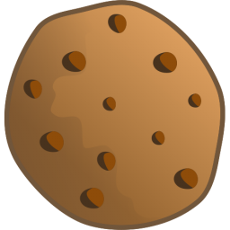

# KakorOnline
Vi i klassen fick i uppgift att göra en hemsida där vi så småningom skulle börja sälja saker. Jag valde kakor, då jag gillar de väldigt mycket, och vill dela med mig av kakor till alla som vill ha. Sidan ligger uppe på vår extremt omoderna, fula och inkorrekt skrivna [hemsida](http://e-handlarna.se). För att komma direkt till min hemsida klickar du [här](http://e-handlarna.se/KakorOnline).

## Koden
Koden är ~~stulen~~ *sammansatt* från olika projekt eller sidor. Stora delar av koden är tagen direkt från [Codrops](http://codrops.com), men anpassad efter hemsidans behov. Jag har också lagt in en sida från [Codecademys](http://codecademy.com) HTML- och CSS-kurs, men återigen anpassad efter sidans behov.

## Min affärsidé
Efter att vi i klassen fick uppgiften om att skapa en hemsida för försäljning (dvs webbshop), så kom jag på idén att göra en hemsida där jag skulle sälja kakor. Min lärare uppskattade både humorn och idén, så jag fortsatte. Jag skrev om ett par sidor från [Codrops](http://codrops.com).

**Kent Beck** sa:
>I'm not a great programmer, I'm just a good programmer with great habits.

